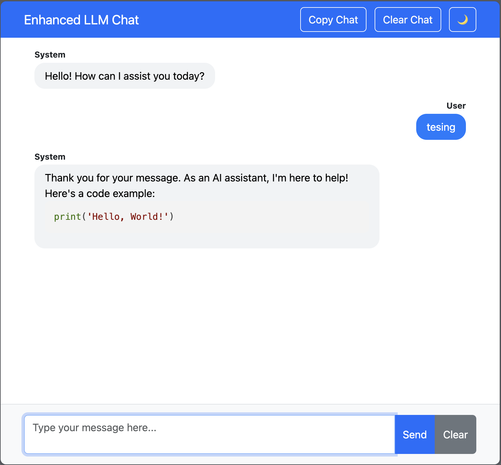

## Enhanced LLM Chat

### Overview
Enhanced LLM Chat is a sleek and user-friendly web-based chat application designed to facilitate interactive and efficient communication with a language model. With this application, users can send messages and receive responses in an immersive chat interface that supports real-time syntax highlighting for code snippets and features a fully functional light/dark mode toggle.

### Features
- **Interactive Chat Interface**: Communicate seamlessly with a language model in a responsive and visually appealing chat layout.
- **Syntax Highlighting**: Automatic detection and highlighting of code snippets for improved readability and usability.
- **Light/Dark Mode**: Easily switch between light and dark themes for a comfortable viewing experience in different lighting conditions.
- **Copy Message Functionality**: Copy individual messages to the clipboard with a single click.
- **Copy Entire Chat**: Effortlessly copy the entire chat history to the clipboard without including unnecessary UI elements.
- **Clear Chat History**: Quickly clear the chat interface to start fresh.
- **Thinking Indicator**: Displays a 'Thinking...' indicator while the system processes responses, enhancing the interaction experience.
- **Responsive Design**: The application is designed to work seamlessly on both desktop and mobile devices.

### How to Use
1. **Send a Message**: Type your message in the input box and click the "Send" button or press Enter. The message will appear in the chat interface as a "User" message.
2. **Receive a Response**: The system processes the input and displays a response as a "System" message.
3. **Copy Messages**: Hover over any message to reveal the copy button and click it to copy the message to your clipboard.
4. **Copy Entire Chat**: Click the "Copy Chat" button in the navigation bar to copy the entire chat history to your clipboard.
5. **Clear Chat History**: Click the "Clear Chat" button to remove all messages from the chat interface.
6. **Toggle Dark Mode**: Click the moon/sun icon to switch between light and dark themes.

### Installation
To set up the Enhanced LLM Chat application, follow these simple steps:
1. Clone the repository:
    ```bash
    https://github.com/codecaine-zz/llm_bootstrap5_template.git
    ```
2. Navigate to the project directory:
    ```bash
    cd enhanced-llm-chat
    ```
3. Open `index.html` in your preferred web browser to start using the application.

# Screenshot   
